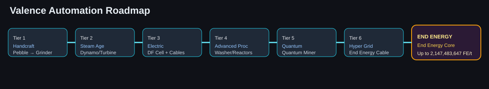

# General Information

Valence is a tech and chemistry oriented minecraft mod, aiming to bring similar chemistry to minecraft like Gregtech but even more difficult. With this, I introduce you to "Valence"

### 🛠️ Requirements
- **Minecraft Version:** `1.20.1`
- **Mod Loader:** Forge (Build `47.4.20` or higher)
- **Java Version:** `Java 17`

### Download

First get the appropriate version in [Releases](https://github.com/karakulakdede32-ui/Valence/releases)

## Published Content Scope (Major Version)

- Polished machine UI using shared Valence GUI visuals and clearer energy telemetry.
- Extended progression after Quantum with a dedicated **End Energy** phase.
- Added End Energy automation parts:
  - **End Energy Core** (final-tier generation + storage)
  - **End Energy Cable** (high-throughput transport)
- Endgame energy generation can scale up to Forge Energy `int` max (`2,147,483,647 FE/t`) through config.

## Long Automation & Progression Line

1. Handcraft: Pebble → Grinder → Basic Miner  
2. Steam Age: Steam Dynamo/Furnace/Alloyer/Turbine  
3. Electric Age: Electric Furnace + DF Cell + conduits  
4. Advanced Processing: Ore Washer → Centrifuge → Reactor → Assembler  
5. Quantum Age: Quantum Miner  
6. Hyper Grid: End Energy Cable network  
7. End Energy: End Energy Core (final stage)

